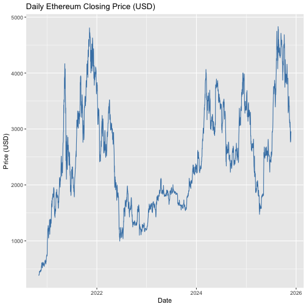
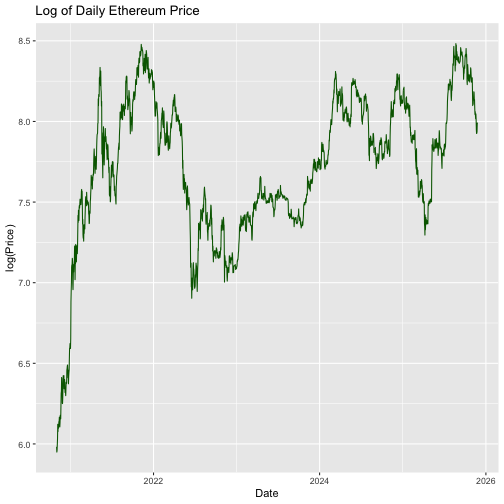
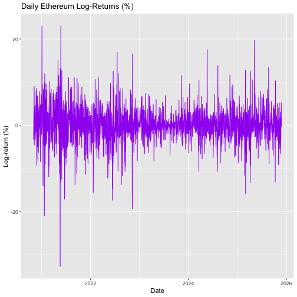
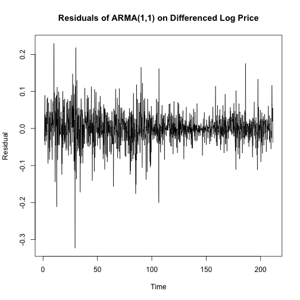
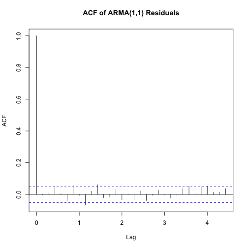
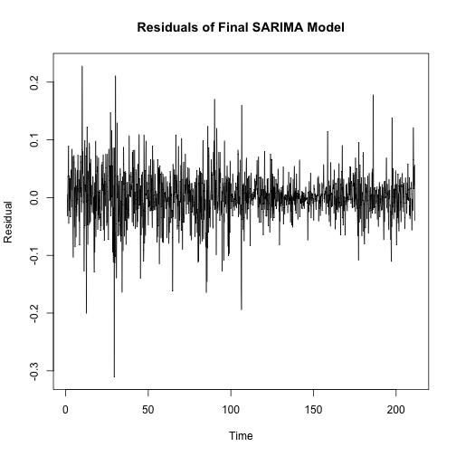
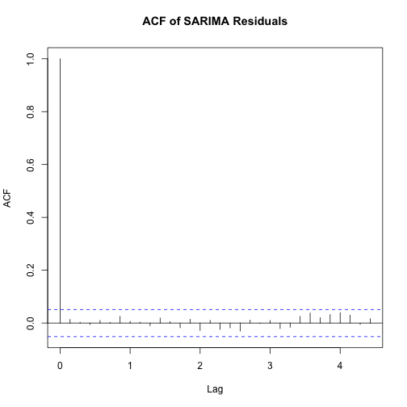

``` r
############################################################
# STEP 1: READ & CLEAN ETHEREUM PRICE DATA (INVESTING.COM)
############################################################

# Install these ONCE if you don't have them:
# install.packages("readr")
# install.packages("dplyr")
# install.packages("lubridate")
# install.packages("janitor")

library(readr)      # for read_csv()
library(dplyr)      # for data cleaning
library(lubridate)  # for dates
library(janitor)    # for clean_names()
```

## Data Reading


``` r
#-----------------------------------------------------------
# 1.1 Read the CSV file
#-----------------------------------------------------------

# Make sure "Ethereum.csv" is in your working directory.
eth_raw <- read_csv("Ethereum.csv")
```

```
## Rows: 1851 Columns: 7
## ── Column specification ────────────────────────────────────────────────────────
## Delimiter: ","
## chr (3): Date, Vol., Change %
## num (4): Price, Open, High, Low
## 
## ℹ Use `spec()` to retrieve the full column specification for this data.
## ℹ Specify the column types or set `show_col_types = FALSE` to quiet this message.
```

``` r
# Look at the raw column names and first few rows
names(eth_raw)
```

```
## [1] "Date"     "Price"    "Open"     "High"     "Low"      "Vol."     "Change %"
```

``` r
head(eth_raw)
```

```
## # A tibble: 6 × 7
##   Date       Price  Open  High   Low Vol.    `Change %`
##   <chr>      <dbl> <dbl> <dbl> <dbl> <chr>   <chr>     
## 1 11/25/2025 2941. 2953. 2958. 2857. 467.94K -0.43%    
## 2 11/24/2025 2953. 2802. 2984. 2764. 777.93K 5.40%     
## 3 11/23/2025 2802. 2770. 2858. 2768. 434.90K 1.14%     
## 4 11/22/2025 2770. 2766. 2799. 2706. 285.19K 0.13%     
## 5 11/21/2025 2767. 2834. 2885. 2631. 1.27M   -2.34%    
## 6 11/20/2025 2833. 3026. 3062. 2792. 979.39K -6.37%
```

``` r
# On Investing.com, columns are usually like:
# "Date", "Price", "Open", "High", "Low", "Vol.", "Change %"

#-----------------------------------------------------------
# 1.2 Clean the column names
#    (turn them into lowercase_with_underscores)
#-----------------------------------------------------------
eth_raw <- clean_names(eth_raw)

# Check new names
names(eth_raw)
```

```
## [1] "date"           "price"          "open"           "high"          
## [5] "low"            "vol"            "change_percent"
```

``` r
# Now they are probably: date, price, open, high, low, vol, change

#-----------------------------------------------------------
# 1.3 Fix the Date column and sort by date
#-----------------------------------------------------------

# Investing.com usually uses format like "Sep 02, 2020"
library(lubridate)

eth <- eth_raw %>%
  mutate(
    # Try common orders: mdy, dmy, ymd.
    # lubridate will parse correctly for most Investing.com files.
    date = parse_date_time(date, orders = c("mdy", "dmy", "ymd"))
  ) %>%
  arrange(date)

head(eth)
```

```
## # A tibble: 6 × 7
##   date                price  open  high   low vol   change_percent
##   <dttm>              <dbl> <dbl> <dbl> <dbl> <chr> <chr>         
## 1 2020-11-01 00:00:00  396.  386.  397.  385. 5.52M 2.55%         
## 2 2020-11-02 00:00:00  384.  396.  404.  379. 9.43M -3.22%        
## 3 2020-11-03 00:00:00  388.  384.  390.  371. 6.73M 1.14%         
## 4 2020-11-04 00:00:00  402.  388.  408.  377. 6.17M 3.68%         
## 5 2020-11-05 00:00:00  417.  402.  420.  396. 7.04M 3.59%         
## 6 2020-11-06 00:00:00  456.  417.  458.  415. 6.53M 9.38%
```

``` r
#-----------------------------------------------------------
# 1.4 Turn price columns from text -> numeric
#     (remove commas like "3,456.78" -> "3456.78")
#-----------------------------------------------------------

# Helper function: remove commas and convert to numeric
to_numeric <- function(x) {
  as.numeric(gsub(",", "", x))
}

eth <- eth %>%
  mutate(
    price = to_numeric(price),  # this is the CLOSE price on Investing.com
    open  = to_numeric(open),
    high  = to_numeric(high),
    low   = to_numeric(low)
    # volume and change can be cleaned later if you need them
  )

# Check structure: price/open/high/low should now be numeric
str(eth)
```

```
## tibble [1,851 × 7] (S3: tbl_df/tbl/data.frame)
##  $ date          : POSIXct[1:1851], format: "2020-11-01" "2020-11-02" ...
##  $ price         : num [1:1851] 396 384 388 402 417 ...
##  $ open          : num [1:1851] 386 396 384 388 402 ...
##  $ high          : num [1:1851] 397 404 390 408 420 ...
##  $ low           : num [1:1851] 385 379 371 377 396 ...
##  $ vol           : chr [1:1851] "5.52M" "9.43M" "6.73M" "6.17M" ...
##  $ change_percent: chr [1:1851] "2.55%" "-3.22%" "1.14%" "3.68%" ...
```

``` r
#-----------------------------------------------------------
# 1.5 Keep only the main columns we need for now
#-----------------------------------------------------------

eth <- eth %>%
  select(date, open, high, low, price)

head(eth)
```

```
## # A tibble: 6 × 5
##   date                 open  high   low price
##   <dttm>              <dbl> <dbl> <dbl> <dbl>
## 1 2020-11-01 00:00:00  386.  397.  385.  396.
## 2 2020-11-02 00:00:00  396.  404.  379.  384.
## 3 2020-11-03 00:00:00  384.  390.  371.  388.
## 4 2020-11-04 00:00:00  388.  408.  377.  402.
## 5 2020-11-05 00:00:00  402.  420.  396.  417.
## 6 2020-11-06 00:00:00  417.  458.  415.  456.
```

``` r
#-----------------------------------------------------------
# 1.6 Create log_price and log_return
#-----------------------------------------------------------

# log_price = natural log of the closing price
eth <- eth %>%
  mutate(
    log_price = log(price)
  )

# log_return = 100 * daily log-return (approx % change)
# This is: 100 * (log_price_today - log_price_yesterday)
eth <- eth %>%
  arrange(date) %>%
  mutate(
    log_return = 100 * (log_price - dplyr::lag(log_price))
  )

# First row has NA log_return (no previous day), that's normal
head(eth)
```

```
## # A tibble: 6 × 7
##   date                 open  high   low price log_price log_return
##   <dttm>              <dbl> <dbl> <dbl> <dbl>     <dbl>      <dbl>
## 1 2020-11-01 00:00:00  386.  397.  385.  396.      5.98      NA   
## 2 2020-11-02 00:00:00  396.  404.  379.  384.      5.95      -3.27
## 3 2020-11-03 00:00:00  384.  390.  371.  388.      5.96       1.14
## 4 2020-11-04 00:00:00  388.  408.  377.  402.      6.00       3.61
## 5 2020-11-05 00:00:00  402.  420.  396.  417.      6.03       3.53
## 6 2020-11-06 00:00:00  417.  458.  415.  456.      6.12       8.97
```

``` r
#-----------------------------------------------------------
# 1.7 Check for missing values and missing dates
#-----------------------------------------------------------

# How many NAs in each column?
colSums(is.na(eth))
```

```
##       date       open       high        low      price  log_price log_return 
##          0          0          0          0          0          0          1
```

``` r
# Check if any calendar days are missing in between
all_dates <- seq(from = min(eth$date, na.rm = TRUE),
                 to   = max(eth$date, na.rm = TRUE),
                 by   = "day")

missing_dates <- setdiff(all_dates, eth$date)
missing_dates
```

```
## POSIXct of length 0
```

``` r
# If this prints character(0), there are NO missing days.
# If you see some dates, those are days with no data.

head(eth)
```

```
## # A tibble: 6 × 7
##   date                 open  high   low price log_price log_return
##   <dttm>              <dbl> <dbl> <dbl> <dbl>     <dbl>      <dbl>
## 1 2020-11-01 00:00:00  386.  397.  385.  396.      5.98      NA   
## 2 2020-11-02 00:00:00  396.  404.  379.  384.      5.95      -3.27
## 3 2020-11-03 00:00:00  384.  390.  371.  388.      5.96       1.14
## 4 2020-11-04 00:00:00  388.  408.  377.  402.      6.00       3.61
## 5 2020-11-05 00:00:00  402.  420.  396.  417.      6.03       3.53
## 6 2020-11-06 00:00:00  417.  458.  415.  456.      6.12       8.97
```

``` r
# date | open | high | low | price | log_price | log_return
```

## Stationary


``` r
###########################################################
# STEP 2: PRELIMINARY PLOTS – SEE IF SERIES IS STATIONARY
###########################################################

library(ggplot2)

## 2.1 Plot raw closing price over time --------------------

ggplot(eth, aes(x = date, y = price)) +
  geom_line(color = "steelblue") +
  labs(title = "Daily Ethereum Closing Price (USD)",
       x = "Date",
       y = "Price (USD)")
```



``` r
# What to look for (for your report):
# - Big upward & downward moves (bubbles, crashes)
# - The average level changes over time
# => This means the series is NOT stationary in level.


## 2.2 Plot log of price over time ------------------------

ggplot(eth, aes(x = date, y = log_price)) +
  geom_line(color = "darkgreen") +
  labs(title = "Log of Daily Ethereum Price",
       x = "Date",
       y = "log(Price)")
```



``` r
# Same idea, but on a log scale.
# Still shows strong trend → still non-stationary.


## 2.3 Plot daily log-returns over time -------------------

ggplot(eth %>% dplyr::filter(!is.na(log_return)),
       aes(x = date, y = log_return)) +
  geom_line(color = "purple") +
  labs(title = "Daily Ethereum Log-Returns (%)",
       x = "Date",
       y = "Log-return (%)")
```



``` r
# Here you should see:
# - Values bouncing around zero
# - Periods of calm and periods of huge spikes (volatility clustering)
# - Much more "stable" mean than the price plots

## 2.4 Quick summary statistics (optional) ----------------

summary(eth$price)
```

```
##    Min. 1st Qu.  Median    Mean 3rd Qu.    Max. 
##   383.5  1713.8  2361.8  2459.7  3219.1  4831.2
```

``` r
sd(eth$price, na.rm = TRUE)
```

```
## [1] 969.0637
```

``` r
summary(eth$log_return)
```

```
##     Min.  1st Qu.   Median     Mean  3rd Qu.     Max.     NA's 
## -32.6921  -1.8554   0.1100   0.1083   2.1059  23.0772        1
```

``` r
sd(eth$log_return, na.rm = TRUE)
```

```
## [1] 4.168713
```

``` r
# You can mention in your report:
# - Price has a huge range (min vs max)
# - Returns have mean ~ 0 but large standard deviation
```

## Data Splitting


``` r
###########################################################
# CHUNK 3: TRAIN / TEST SPLIT (KEEP TIME ORDER)
###########################################################

# We will work with log_price (because ARIMA normally models log prices).
# First, create a time-series object for log_price.
log_price_ts <- ts(eth$log_price, frequency = 7)  # daily data, weekly pattern

# Total length of the series
n_total <- length(log_price_ts)

# Choose how much goes into training.
# For example: 80% train, 20% test
train_ratio <- 0.8
n_train <- floor(train_ratio * n_total)

# Split the series:
log_price_train_ts <- window(log_price_ts, end = c(0, n_train))
log_price_test_ts  <- window(log_price_ts, start = c(0, n_train + 1))

# Simple checks
length(log_price_train_ts)  # should be about 80% of total
```

```
## [1] 1473
```

``` r
length(log_price_test_ts)   # remaining 20%
```

```
## [1] 378
```

``` r
# In words:
# - log_price_train_ts = earlier dates (used to fit models)
# - log_price_test_ts  = most recent dates (used to check forecast accuracy)
```

## Differencing


``` r
###########################################################
# CHUNK 4: STATIONARITY – ADF + DIFFERENCING
###########################################################

library(tseries)  # for adf.test()

## 4.1 ADF test on log_price (training part) --------------

adf_log_price_train <- adf.test(log_price_train_ts)
adf_log_price_train
```

```
## 
## 	Augmented Dickey-Fuller Test
## 
## data:  log_price_train_ts
## Dickey-Fuller = -3.2102, Lag order = 11, p-value = 0.08616
## alternative hypothesis: stationary
```

``` r
# Interpretation (for report):
# - H0: series has a unit root (non-stationary).
# - If p-value is large (usually > 0.05), we FAIL to reject H0:
#   log_price is NON-STATIONARY.


## 4.2 First difference of log_price (training) ------------

# This creates a series of daily changes in log price:
d_log_price_train_ts <- diff(log_price_train_ts)

# Plot to see it
plot(d_log_price_train_ts,
     main = "Differenced Log Price (Training Data)",
     xlab = "Time", ylab = "diff log(price)")
```


``` r
## 4.3 ADF test on differenced log_price -------------------

adf_d_log_price_train <- adf.test(d_log_price_train_ts)
```

```
## Warning in adf.test(d_log_price_train_ts): p-value smaller than printed p-value
```

``` r
adf_d_log_price_train
```

```
## 
## 	Augmented Dickey-Fuller Test
## 
## data:  d_log_price_train_ts
## Dickey-Fuller = -10.919, Lag order = 11, p-value = 0.01
## alternative hypothesis: stationary
```

``` r
# Now we expect a SMALL p-value (< 0.05):
# - We REJECT H0 and say: differenced log price is STATIONARY.
# - This differenced series is what we will use for ARMA/ARIMA(p,0,q).
```

## ARMA


``` r
###########################################################
# CHUNK 5: BASELINE ARMA(1,1) MODEL
###########################################################

# We use stats::arima(). Because we already differenced manually,
# we set d = 0 in the order: (p, d, q) = (1, 0, 1).

arma11_fit <- arima(d_log_price_train_ts, order = c(1, 0, 1))

# Look at the model output
arma11_fit
```

```
## 
## Call:
## arima(x = d_log_price_train_ts, order = c(1, 0, 1))
## 
## Coefficients:
##           ar1     ma1  intercept
##       -0.7783  0.7417     0.0014
## s.e.   0.1355  0.1439     0.0011
## 
## sigma^2 estimated as 0.001781:  log likelihood = 2570.57,  aic = -5133.15
```

``` r
# Check residuals – they should look like white noise
arma11_res <- residuals(arma11_fit)

# Plot residuals
plot(arma11_res,
     main = "Residuals of ARMA(1,1) on Differenced Log Price",
     xlab = "Time", ylab = "Residual")
```



``` r
# ACF of residuals
acf(arma11_res,
    main = "ACF of ARMA(1,1) Residuals")
```



``` r
# Interpretation:
# - If many spikes in the residual ACF are still outside the blue bands,
#   the model has not captured all the structure.
# - That tells us we may need a higher-order ARMA(p,q)
#   (e.g., ARMA(2,2), ARMA(5,5), etc.)
```

## Testing


``` r
###########################################################
# CHUNK 6: ARIMA(p,0,q) MODEL SEARCH & LLR TEST
###########################################################

# We'll try a small set of candidate (p, q) pairs.
# You can adjust this list later if you want more/less.
candidate_orders <- list(
  c(1, 0, 1),
  c(2, 0, 2),
  c(3, 0, 3),
  c(4, 0, 4),
  c(5, 0, 5)
)

# Data frame to store results
results <- data.frame(
  p      = integer(),
  q      = integer(),
  logLik = numeric(),
  AIC    = numeric(),
  stringsAsFactors = FALSE
)

# Fit each model and collect LL and AIC
for (ord in candidate_orders) {
  p <- ord[1]
  q <- ord[3]
  
  fit <- arima(d_log_price_train_ts, order = ord)
  
  results <- rbind(
    results,
    data.frame(
      p      = p,
      q      = q,
      logLik = as.numeric(logLik(fit)),
      AIC    = AIC(fit)
    )
  )
}

# Look at the table of models
results
```

```
##   p q   logLik       AIC
## 1 1 1 2570.574 -5133.148
## 2 2 2 2570.935 -5129.870
## 3 3 3 2575.583 -5135.167
## 4 4 4 2579.061 -5138.121
## 5 5 5 2580.423 -5136.846
```

``` r
# Lower AIC is better; higher logLik is better.
# You can see which (p, q) looks best.

#----------------------------------------------------------
# 6.2 LLR test between two models
#    Example: compare ARIMA(4,0,4) and ARIMA(5,0,5)
#----------------------------------------------------------

# Fit the two models explicitly
fit_404 <- arima(d_log_price_train_ts, order = c(4, 0, 4))
fit_505 <- arima(d_log_price_train_ts, order = c(5, 0, 5))

# Helper function for LLR test
llr_test <- function(model_big, model_small, df_diff) {
  # LR statistic
  LR <- 2 * (as.numeric(logLik(model_big)) - as.numeric(logLik(model_small)))
  # p-value from chi-squared distribution
  p_value <- 1 - pchisq(LR, df = df_diff)
  
  return(list(LR = LR, p_value = p_value))
}

# Difference in number of parameters:
# ARIMA(p,0,q) has (p + q) AR/MA parameters plus maybe intercept.
# Roughly: df_diff = (5+5) - (4+4) = 2
test_505_vs_404 <- llr_test(fit_505, fit_404, df_diff = 2)
test_505_vs_404
```

```
## $LR
## [1] 2.724709
## 
## $p_value
## [1] 0.2560571
```

``` r
# Interpretation:
# - If p_value is small (< 0.05), the larger model (5,0,5)
#   is significantly better than the smaller one (4,0,4).
# - If p_value is large, the simpler model is sufficient.
```

## ARIMA


``` r
###########################################################
# CHUNK 7A: BASIC ARIMA MODELS (NO SEASONALITY)
###########################################################

# We let the ARIMA function do the differencing for us.
# So we work directly on log_price_train_ts.

# Example 1: ARIMA(1,1,1)
arima_111 <- arima(log_price_train_ts, order = c(1, 1, 1))

arima_111
```

```
## 
## Call:
## arima(x = log_price_train_ts, order = c(1, 1, 1))
## 
## Coefficients:
##           ar1     ma1
##       -0.7706  0.7338
## s.e.   0.1442  0.1524
## 
## sigma^2 estimated as 0.001783:  log likelihood = 2569.69,  aic = -5133.38
```

``` r
logLik(arima_111)
```

```
## 'log Lik.' 2569.691 (df=3)
```

``` r
AIC(arima_111)
```

```
## [1] -5133.382
```

``` r
# Example 2: a slightly richer model ARIMA(5,1,5)
arima_515 <- arima(log_price_train_ts, order = c(5, 1, 5))
```

```
## Warning in arima(log_price_train_ts, order = c(5, 1, 5)): possible convergence
## problem: optim gave code = 1
```

``` r
arima_515
```

```
## 
## Call:
## arima(x = log_price_train_ts, order = c(5, 1, 5))
## 
## Coefficients:
##           ar1      ar2     ar3     ar4     ar5     ma1     ma2      ma3
##       -1.2604  -0.3385  0.5701  1.1842  0.8303  1.2109  0.3138  -0.5152
## s.e.   0.0895   0.1000  0.0613  0.1043  0.0554  0.0864  0.0867   0.0708
##           ma4     ma5
##       -1.1223  -0.839
## s.e.   0.0915   0.046
## 
## sigma^2 estimated as 0.001747:  log likelihood = 2584.45,  aic = -5146.9
```

``` r
logLik(arima_515)
```

```
## 'log Lik.' 2584.451 (df=11)
```

``` r
AIC(arima_515)
```

```
## [1] -5146.903
```

``` r
# You can add other (p,d,q) if you want, e.g. (2,1,2), (3,1,3), etc.
# The idea:
# - Higher logLik is better
# - Lower AIC is better
# Save the one with the smallest AIC as your "best ARIMA" model.
```

## SARIMA


``` r
###########################################################
# CHUNK 7B: SARIMA MODELS WITH WEEKLY SEASONALITY (m = 7)
###########################################################

# The general form is:
# arima(log_price_train_ts,
#       order    = c(p, 1, q),
#       seasonal = list(order = c(P, D, Q), period = 7))

# 1️⃣ Start with a modest SARIMA:
sarima_111_101 <- arima(
  log_price_train_ts,
  order    = c(1, 1, 1),              # non-seasonal (p,d,q)
  seasonal = list(order = c(1, 0, 1), # seasonal (P,D,Q)
                  period = 7)         # weekly seasonality
)

sarima_111_101
```

```
## 
## Call:
## arima(x = log_price_train_ts, order = c(1, 1, 1), seasonal = list(order = c(1, 
##     0, 1), period = 7))
## 
## Coefficients:
##           ar1    ma1    sar1     sma1
##       -0.7697  0.734  0.2589  -0.2716
## s.e.   0.1486  0.157  0.6706   0.6779
## 
## sigma^2 estimated as 0.001783:  log likelihood = 2569.81,  aic = -5129.63
```

``` r
logLik(sarima_111_101)
```

```
## 'log Lik.' 2569.813 (df=5)
```

``` r
AIC(sarima_111_101)
```

```
## [1] -5129.626
```

``` r
# 2️⃣ Try higher non-seasonal orders similar to the article
#    (2,1,2), (3,1,3), (5,1,5), always with seasonal (1,0,1)[7]

sarima_212_101 <- arima(
  log_price_train_ts,
  order    = c(2, 1, 2),
  seasonal = list(order = c(1, 0, 1), period = 7)
)

sarima_313_101 <- arima(
  log_price_train_ts,
  order    = c(3, 1, 3),
  seasonal = list(order = c(1, 0, 1), period = 7)
)
```

```
## Warning in arima(log_price_train_ts, order = c(3, 1, 3), seasonal = list(order
## = c(1, : possible convergence problem: optim gave code = 1
```

``` r
sarima_515_101 <- arima(
  log_price_train_ts,
  order    = c(5, 1, 5),
  seasonal = list(order = c(1, 0, 1), period = 7)
)
```

```
## Warning in arima(log_price_train_ts, order = c(5, 1, 5), seasonal = list(order
## = c(1, : possible convergence problem: optim gave code = 1
```

``` r
# 3️⃣ Put their logLik and AIC in a small table to compare
sarima_results <- data.frame(
  model = c("SARIMA(1,1,1)x(1,0,1)[7]",
            "SARIMA(2,1,2)x(1,0,1)[7]",
            "SARIMA(3,1,3)x(1,0,1)[7]",
            "SARIMA(5,1,5)x(1,0,1)[7]"),
  logLik = c(logLik(sarima_111_101),
             logLik(sarima_212_101),
             logLik(sarima_313_101),
             logLik(sarima_515_101)),
  AIC    = c(AIC(sarima_111_101),
             AIC(sarima_212_101),
             AIC(sarima_313_101),
             AIC(sarima_515_101))
)

sarima_results
```

```
##                      model   logLik       AIC
## 1 SARIMA(1,1,1)x(1,0,1)[7] 2569.813 -5129.626
## 2 SARIMA(2,1,2)x(1,0,1)[7] 2578.465 -5142.930
## 3 SARIMA(3,1,3)x(1,0,1)[7] 2579.505 -5141.009
## 4 SARIMA(5,1,5)x(1,0,1)[7] 2585.075 -5144.151
```

``` r
# Pick the SARIMA with the LOWEST AIC as your "best SARIMA".
# (most likely SARIMA(5,1,5)x(1,0,1)[7], like in the article)
```

## Comparision


``` r
###########################################################
# CHUNK 8: COMPARE BEST ARIMA VS BEST SARIMA
###########################################################

# Helper: Likelihood Ratio Test between two models
llr_test <- function(model_big, model_small) {
  # LR statistic
  LR <- 2 * (as.numeric(logLik(model_big)) - as.numeric(logLik(model_small)))
  
  # difference in number of parameters
  df_diff <- length(coef(model_big)) - length(coef(model_small))
  
  # p-value from Chi-square distribution
  p_value <- 1 - pchisq(LR, df = df_diff)
  
  return(list(LR = LR, df = df_diff, p_value = p_value))
}

# 8.1 Compare ARIMA(5,1,5) vs SARIMA(5,1,5)x(1,0,1)[7]
# (SARIMA has more parameters → treat SARIMA as "big" model)

test_sarima_vs_arima <- llr_test(sarima_515_101, arima_515)
test_sarima_vs_arima
```

```
## $LR
## [1] 1.248286
## 
## $df
## [1] 2
## 
## $p_value
## [1] 0.5357203
```

``` r
# Interpretation:
# - Look at AIC:
#     AIC(arima_515)
#     AIC(sarima_515_101)
#   SARIMA should have lower AIC if it is better.
#
# - From LLR:
#   If p_value is very small (< 0.05, often close to 0),
#   then adding weekly seasonality (the SARIMA model)
#   gives a significantly better fit than plain ARIMA.

AIC(arima_515)
```

```
## [1] -5146.903
```

``` r
AIC(sarima_515_101)
```

```
## [1] -5144.151
```

## Residual Diagnostics


``` r
###########################################################
# CHUNK 9: RESIDUAL DIAGNOSTICS FOR FINAL SARIMA
###########################################################

# Residuals of final SARIMA
sarima_res <- residuals(sarima_515_101)

# 9.1 Plot residuals over time
plot(sarima_res,
     main = "Residuals of Final SARIMA Model",
     xlab = "Time", ylab = "Residual")
```



``` r
# 9.2 ACF of residuals
acf(sarima_res,
    main = "ACF of SARIMA Residuals")
```



``` r
# 9.3 ADF test on residuals (should be stationary, just noise)
library(tseries)
adf_res <- adf.test(sarima_res)
```

```
## Warning in adf.test(sarima_res): p-value smaller than printed p-value
```

``` r
adf_res
```

```
## 
## 	Augmented Dickey-Fuller Test
## 
## data:  sarima_res
## Dickey-Fuller = -10.743, Lag order = 11, p-value = 0.01
## alternative hypothesis: stationary
```

``` r
# How to interpret in your report:
# - Residual series fluctuates around 0 with no clear pattern.
# - ACF of residuals shows almost all spikes inside the bands
#   → no remaining autocorrelation.
# - ADF test has a small p-value → residuals are stationary.
# Together this suggests the final SARIMA model has captured
# almost all predictable structure, leaving only white noise.
```

